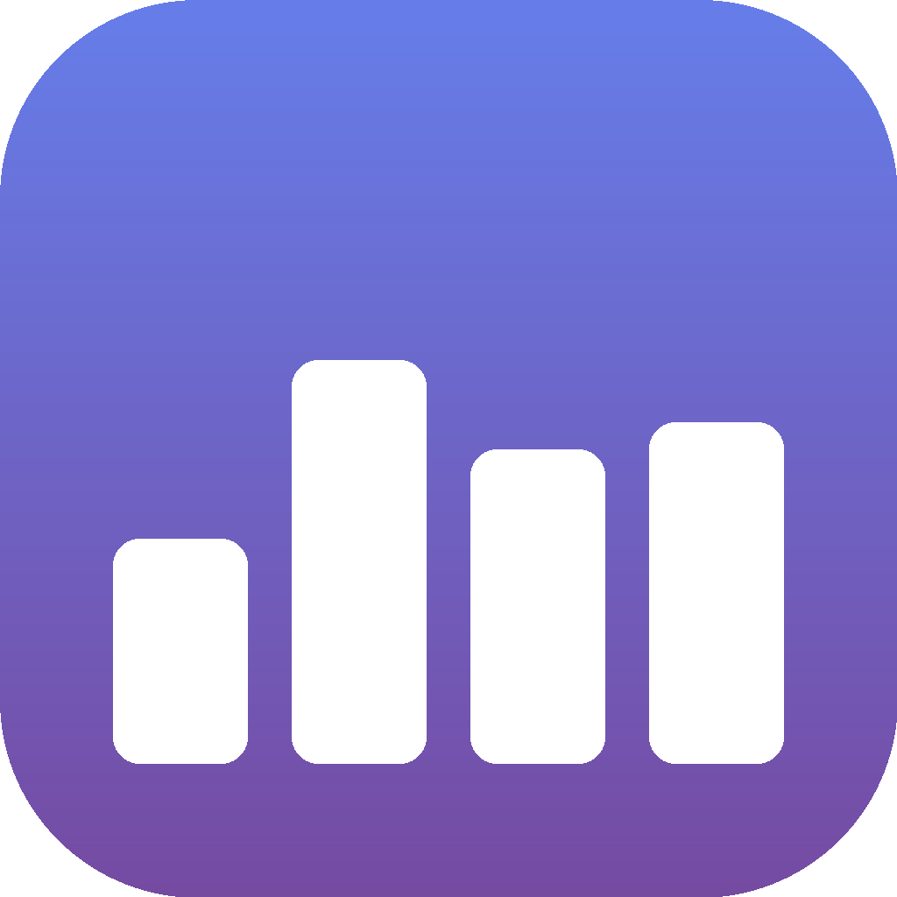
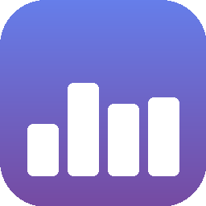

# Kafeel Icon Showcase

## Visual Preview

The Kafeel app icon at different sizes:

### Large (1024x1024)


Perfect for:
- App Store listings
- High-resolution displays
- Marketing materials

### Medium (256x256)


Perfect for:
- About screen
- Finder icon view
- Dock on standard displays

### Small (128x128)


Perfect for:
- Sidebar headers
- List views
- App switcher

### Tiny (32x32)


Perfect for:
- Menu bar (when using SF Symbols isn't suitable)
- Toolbar buttons
- Compact UI elements

## Design Elements

### Color Palette
- Primary: #667eea (Medium purple-blue)
- Secondary: #764ba2 (Deep purple)
- Accent: White (#FFFFFF)
- Style: Linear gradient from top-left to bottom-right

### Bar Chart Composition
- 4 bars representing activity levels
- Heights: 25%, 45%, 35%, 38% of icon size
- Width: 15% of icon size each
- Spacing: 5% of icon size
- Corner radius: 3% of icon size

### Icon Shape
- Rounded square (squircle)
- Corner radius: 22% of icon size
- Follows macOS Human Interface Guidelines
- Continuous corner style for smooth appearance

## Use Cases

### In-App Display
```swift
// Sidebar (32x32)
AppIconView(size: 32)

// About screen (128x128)
AppIconView(size: 128)

// Menu bar (18x18, monochrome)
MenuBarIconView(size: 18)
```

### macOS Integration
- **Dock**: Uses Kafeel.icns automatically
- **Finder**: Shows appropriate size based on view mode
- **Spotlight**: Uses 32x32 or 64x64 for search results
- **Mission Control**: Scaled appropriately for thumbnails

## Icon Philosophy

The design conveys:
1. **Productivity**: Bar chart suggests metrics and tracking
2. **Analytics**: Data visualization metaphor
3. **Progress**: Varying heights show growth and activity
4. **Focus**: Clean, uncluttered design aids concentration
5. **Modern**: Gradient and rounded corners feel contemporary

## Variants

### Full Color (AppIconView)
- Used: App icon, sidebar, about screen
- Style: Gradient background with white bars
- Best for: Branding, high-visibility contexts

### Monochrome (MenuBarIconView)
- Used: Menu bar, toolbar
- Style: Template icon (system-colored)
- Best for: Small sizes, system integration

### SF Symbol Fallback
- Symbol: "chart.bar.fill"
- Used: When custom icons aren't loaded
- Best for: Quick prototyping, universal compatibility

## Technical Specifications

- Format: PNG with alpha channel
- Color space: sRGB
- Bit depth: 32-bit RGBA
- Compression: PNG standard
- Total set size: ~60KB (all PNGs) + 58KB (.icns)

## Attribution

Icon designed and generated for Kafeel Activity Tracker
Created programmatically using Python/PIL
SwiftUI implementation available in AppIconView.swift
